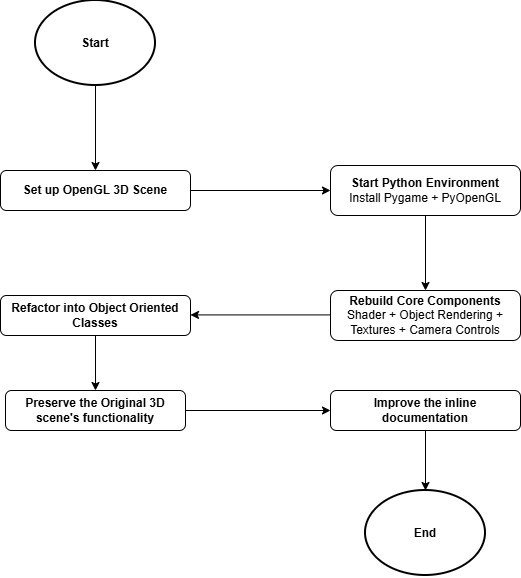

# **Michael King CS-499 ePortfolio**

# **Enhancement One: Software Design & Engineering**

## **Artifact Description**
The artifact that was used for the Software Design and Engineering enhancement was the 3D computational graphics scene that was originally developed for **CS-330: Computational Graphics and Visualization.** The project was developed as part of the CS-330 course requirements and is a complete interactive 3D still life of a kitchen constructed in C++ using the OpenGL 3.3 Core Profile graphics API together with the windowing and extension, loading the GLFW and GLEW libraries. The scene renders seven independent objects: a wooden table surface, a yellow cutting board, a ceramic coffee mug, a fabric mug handle, a terra cotta ramekin bowl, a stainless steel fork, and a stainless steel knife, all with per-object Phong shading, texture mapping, and a two-light illumination model. The original application also employs a free-flying FPS style camera with keyboard and mouse input, perspective and orthographic projection, and UV tiling. The code is organized into six source files: *MainCode.cpp*, *ViewManager*, *ShaderManager*, *SceneManager*, *ShapeMeshes*, and *camera.h*.

## **Why This Artifact Was Selected**
The artifact was chosen as a representative sample of my portfolio because it is the most technically rich and visually impressive project I have completed during my Computer Science studies. In particular, performing graphics programming on the computer calls for a programmer to be familiar with low-level systems programming, linear algebra, the rendering pipeline of the GPU, and real-time user inputs, something that is rarely captured in one project. The decision to port a project from C++ to Python was a large step in its own right; it was not simply based on superficial concerns like language syntax, but represented a complete revisit of the entire architecture of the original implementation. The artifact is visually interesting and would be a strong visual component of a professional ePortfolio.

## **What The Enhancement Improved**
The Python port alone adds inline docstrings to every class and method, complete with parameter and return annotations and insightful commentary on design decisions, most of which were absent in the C++ version. The procedural approach to mesh generation cuts down the 96KB of raw vertex data that made up the ShapeMeshes *(one of the larger files in the original project)* and packs it into a manageable, parameter-driven algorithm. The class hierarchy is more modular due to Python’s module archiving *(rather than larger header/implementation file pairs common in C++)*, and each class is entirely self-sufficient. Input handling is simpler due to Pygame’s lack of callback architecture *(replacing the key event handler callbacks from GLFW)*, and key debouncing is achieved through clear logical conditionals instead of raising state variables. A shader load failure check is added to the application entry point to prevent the program from receiving an invalid ID if the shader cannot be compiled, to prevent silent continuation; instead, a clean exit is given. The call to enable the depth test was moved out of the render method *(to once a second, previously 60 times a second)*. The return values from glGenTextures/glGenVertexArrays are now plain Python integers, passed through the Python int function, rather than handling a behavior change in PyOpenGL 3.14, where these functions now return arrays rather than scalar integer types.

## **Enhancement Flowchart**

## **Course Outcome Alignment**
### Outcome 1
**Demonstrate an ability to use well-founded and innovative techniques, skills, and tools in computing practices for the purpose of implementing computer solutions that deliver value and accomplish industry-specific goals.**

### How This Outcome Is Demonstrated
This outcome is demonstrated through the cross-language, cross-toolchain migration of a working OpenGL program, by utilizing the standard Python libraries used in the scientific and visualization computing industries, and by the described architectural enhancements. The ability to migrate a complex graphics program from one language and set of libraries to another is an industry-related competency in the field of game development, simulation, and scientific visualization. 

### Outcome 2
**Design, develop, and deliver professional-quality oral, written, and visual communications that are coherent, technically sound, and appropriately adapted to specific audiences and contexts, as the refactored and documented code will be presented in a professional ePortfolio context.**

### How This Outcome Is Demonstrated
This outcome is demonstrated during the trade-off analysis, such as whether to use procedural generation of the mesh instead of literal vertex arrays *(which trades file size and generation time for readability and parameterizability)*, and whether to use Pygame CE instead of Pygame *(which trades the expected Pygame library for support in the latest Python 3.14)*. These decisions were planned, documented, and supported using software engineering logic. No modifications to the existing outcome or coverage plan were necessary. The improvement made is the same as the plan outlined in the first module, and all six planned Python modules have been written and verified to run successfully.

## **What I Learned**
Of the major lessons learned during this enhancement, the one that stands out most is that there are nuanced differences between C++ and Python in language semantics that can make software behave in ways that are difficult to predict. In particular, the subtle “idiomatic” behavior of the input event handling system led to the most educational bug, where the camera’s movement speed would get set back to an unusually low value each time any movement key was pressed. After exhaustive debugging of the input event handling code, this was narrowed down to a one-character typo in *camera.py*:

`velocity = self.movement_speed = delta_time`

I used Python’s chained assignment operator to apply `delta_time` to both `velocity` and `self.movement_speed` at once. In C++, this expression chains assignments from right to left and leaves the two variables as separate memory locations, resulting in the desired behavior. In Python, the chained assignment assigns the same value to each target, causing `movement_speed` to be reset to the frame delta time for each key press. The proper line is

`velocity = self.movement_speed * delta_time`

This reinforced the learning that cross-language porting is not simply a matter of syntactic translation, but actually involves reasoning about the semantic differences of language constructs that are visually similar. It also made evident that a systematic debugging approach can be powerful: The symptom of a speed reset on movement was quite distinct and easily generalized to the keyboard handler; the only place in *camera.py* where `movement_speed` could be set on keypress was the `process_keyboard` method.

## **Narrative**

[**Read Full Narrative**](https://github.com/michaelk462/michaelk462.github.io/blob/main/Narratives/CS-499%20Enhancement%20One%20Narrative.pdf)

## **Original Project vs. Enhancement**

### Screenshot of the Original CS-330 3D Scene Built in C++

!(assets/images/CS-330 Original Screenshot.jpg)

### Screenshot of the Enhanced CS-330 3D Scene Built in Python

!(assets/images/CS-330 Enhancement.jpg)

### Original and Enhanced Artifact Files

[**Original Artifact Files**](https://github.com/michaelk462/michaelk462.github.io/tree/main/original-code/CS330)

[**Enhanced Artifact Files**](https://github.com/michaelk462/michaelk462.github.io/tree/main/enhanced-code/CS330)

### Downloads

[**Original** (~19.7 MB)](CS330Original.zip)

[**Enhancement** (~6.7 MB)](CS330Enhancement.zip)

# **Links**

[**Professional Self-Assessment**](index)

[**Code Review**](code-review)

[**Enhancement One: Software Design & Engineering**](enhancement-one)

[**Enhancement Two: Algorithms & Data Structures**](enhancement-two)

[**Enhancement Three: Databases**](enhancement-three)
